# Typed Dangerous-Action Risk Budgets

Ardur's optional `risk_budget` claim reserves signed impact ceilings before a configured dangerous tool may run.

A trusted tool contract derives typed facts from schema-validated arguments,
compares them with signed per-action caps, and atomically reserves additive
session, agent, and lineage ceilings. Passports without `risk_budget` keep the
existing behavior.

This is an enforcement boundary for configured proxy/adaptor calls. It is not
automatic discovery of every side effect, a semantic-risk classifier, or
proof that the tool reported truthful arguments.

## Decision flow

```mermaid
flowchart LR
    A["Authenticated tool schema and risk contract"] --> B["Validate arguments and derive typed facts"]
    B --> C["Check signed per-action caps"]
    C --> D["Atomically reserve session, agent, and lineage ceilings"]
    D --> E["Run ordinary Ardur policy and approval checks"]
    E --> F["PERMIT: adapter may dispatch"]
    F --> G["Executor records committed or released"]
    G --> H["Signed lifecycle receipt"]
```



The reservation happens before ordinary policy returns `PERMIT`. If ordinary
policy denies, Ardur releases the reservation because the external executor
has not started. If policy evaluation raises, Ardur retains the reservation:
an exception is not evidence that execution never began. Proxy-internal memory
tools execute during policy evaluation and therefore cannot be registered for
typed risk governance.

## Trusted tool contract

`ToolRiskContract.from_schema(tool_name, input_schema, risk_contract)` binds
the following RFC 8785-canonical object to a `sha256:<hex>` digest:

```json
{
  "tool_name": "storage.delete_objects",
  "input_schema": {
    "type": "object",
    "properties": {
      "targets": {"type": "array", "items": {"type": "string"}},
      "bytes": {"type": "integer", "minimum": 0},
      "irreversibility": {
        "type": "string",
        "enum": ["reversible", "compensatable", "irreversible"]
      }
    },
    "required": ["targets", "bytes", "irreversibility"],
    "additionalProperties": false
  },
  "risk_contract": {
    "version": 1,
    "mandatory_facts": [
      "objects_affected",
      "bytes_affected",
      "irreversibility"
    ],
    "extractors": {
      "objects_affected": {"kind": "array_length", "pointer": "/targets"},
      "bytes_affected": {"kind": "integer", "pointer": "/bytes"},
      "irreversibility": {"kind": "enum", "pointer": "/irreversibility"}
    }
  }
}
```

The extractor vocabulary is closed:

| Kind | Source | Result |
|---|---|---|
| `integer` | RFC 6901 pointer | Exact non-negative integer; booleans and floats deny |
| `array_length` | RFC 6901 pointer | Non-negative array length |
| `enum` | RFC 6901 pointer | A value in the fact's versioned categorical order |
| `constant` | Contract value | A trusted numeric or categorical constant |

Input schemas use JSON Schema 2020-12. Invalid schemas, external references,
oversized/deep schemas, malformed pointers, oversized arguments, missing fact
sources, and schema-invalid arguments fail closed. The registry rejects
replacement and freezes at proxy startup. Contracts retain canonical byte
snapshots internally; returned schema and extractor objects are detached views
that cannot mutate registered authority or its digest.

MCP `inputSchema` is suitable contract input only after the server and tool
definition have been authenticated. MCP tool annotations are untrusted hints
unless the server itself is trusted, so Ardur does not use them as risk facts.
Prompt text, model-generated risk labels, network lookups, scanners, and tool
execution are also outside extraction.

## Fact vocabulary

Version 1 supports additive numeric facts:

- `destructive_targets`
- `objects_affected`
- `bytes_affected`

It also supports ordered categorical facts:

- `secret_sensitivity`: `none`, `public`, `internal`, `confidential`,
  `restricted`, `regulated`, `unknown`
- `destination_risk`: `local`, `private_network`, `trusted_service`,
  `public_internet`, `untrusted`, `unknown`
- `filesystem_scope`: `none`, `declared`, `workspace`, `external`, `system`,
  `unknown`
- `irreversibility`: `reversible`, `compensatable`, `irreversible`, `unknown`

`unknown` facts deny a governed action. Numeric values are bounded to signed
64-bit non-negative integers.

## Mission Passport claim

```json
{
  "risk_budget": {
    "version": 1,
    "lineage_id": "<root passport jti or issuer-selected lineage>",
    "tools": {
      "storage.delete_objects": {
        "contract_digest": "sha256:<64 lowercase hex>",
        "max_facts": {
          "objects_affected": 10,
          "bytes_affected": 1048576,
          "irreversibility": "compensatable"
        }
      }
    },
    "ceilings": {
      "objects_affected": {"session": 20, "agent": 50, "lineage": 100},
      "bytes_affected": {
        "session": 2097152,
        "agent": 5242880,
        "lineage": 10485760
      }
    }
  }
}
```

Every numeric fact used by a tool policy requires all three ceilings. Tool
entries must be a subset of `allowed_tools`. A root issuer fills an omitted
`lineage_id` with the new passport JTI. Child passports inherit the policy or
provide an explicit policy with the same lineage, the same contract digests
and fact sets, a subset of tools, and caps/ceilings no greater than their
parent. A parent without `risk_budget` cannot introduce it in a child.

The first governed call freezes a normalized risk-policy snapshot in the
persisted session. Later mission-policy refreshes may continue to affect other
authorization rules, but a changed or removed risk policy fails closed. Outcome
accounting uses the ceilings captured in the reservation, not a later policy
view.

## Runtime API

Create and freeze contracts before constructing the proxy:

```python
registry = ToolRiskRegistry()
registry.register(contract)
proxy = GovernanceProxy(risk_registry=registry, ...)
```

Each governed invocation requires a unique executor-generated request ID:

```python
decision, reason = proxy.evaluate_tool_call(
    session,
    "storage.delete_objects",
    arguments,
    risk_request_id=request_id,
)
```

The HTTP equivalent supplies `risk_request_id` to `POST /evaluate`. After a
`PERMIT`, report exactly one explicit outcome:

```python
proxy.record_risk_outcome(
    session,
    risk_request_id=request_id,
    outcome="committed",  # or "released"
)
```

The HTTP equivalent is `POST /risk/outcome` with `session_id`,
`risk_request_id`, and `outcome`. `released` is valid only when the executor
did not start. If execution may have started, record `committed` even when the
tool later reports an error. A repeated active, committed, or released request
ID cannot receive another `PERMIT`.

## Crash and lifecycle behavior

The file ledger stores only hashes of lineage, session, agent, request, and
fingerprint identities. One `flock`-protected, fsync-backed replacement
transaction updates every fact and scope. Ledger invariants require account
`reserved` totals to equal active plus quarantined reservations and account
`spent` totals to equal retained plus archived committed reservations.

`quarantine_stale_risk_reservations(session, stale_after_s=...)` converts stale
active reservations for that session to `quarantined` without returning
authority. Quarantine and later explicit reconciliation produce separate
signed lifecycle receipts. A session cannot end or issue its final attestation
while active or quarantined reservations remain.

Quarantined reservations cannot be released; explicit reconciliation may only
commit them. After passport expiry and at least 24 hours in quarantine, pruning
conservatively archives them as spent. Expired committed/released records are
pruned only after their lifecycle receipt is delivered. Committed amounts move
to `archived_spent`, so pruning never restores spent authority. Every pruned
record leaves a request/fingerprint hash tombstone for at least one additional
hour, preventing compaction from re-permitting the same request during its
authorization lifetime. Both reservation and tombstone stores are bounded;
capacity exhaustion fails closed until maintenance advances retention.

Outcome and quarantine transitions use a durable receipt outbox. The ledger
records a deterministic lifecycle ID, the session atomically persists the
signed receipt material, the receipt journal appends that receipt ID at most
once with `fsync`, and only then does the ledger mark delivery complete. A retry
after any intermediate crash resumes the same receipt rather than minting a
second chain entry. Ledger files and locks reject symlink substitution and use
private `0700`/`0600` modes.

## Receipts, metrics, and privacy

Action and lifecycle receipts include:

- `measurements.risk_facts`: a SHA-256 digest of canonical typed facts;
- bounded `budget_remaining` keys such as `objects_affected.lineage`; and
- stable internal denial codes, with risk exhaustion mapped to the public
  `budget_exhausted` class.

They do not include raw targets, paths, URLs, secrets, facts, request IDs, or
ledger identity hashes. Lifecycle events are excluded from ordinary action
permit/denial counts and tool-scope checks. Prometheus metrics use only fixed
operation, outcome, fact, and reason labels.

## Failure behavior

| Condition | Decision |
|---|---|
| Missing/invalid request ID, policy, contract, fact, or ledger state | `INSUFFICIENT_EVIDENCE` |
| Per-action cap exceeded | `DENY` |
| Session/agent/lineage ceiling exhausted | `DENY` |
| Active or terminal request replay | `DENY` |
| Ordinary policy denies after reservation | Ordinary denial; reservation released |
| Policy evaluation raises after reservation | Exception propagated; reservation retained |
| Attempt to release a quarantined reservation | Reconciliation denied; authority retained |
| Unresolved action at session end | Session finalization denied |

## Operability and cost

The runtime performs no risk-classification network calls and adds no cloud
service charge by itself. Each governed action adds a local canonicalization,
JSON Schema validation, and fsync-backed reservation; each outcome adds another
ledger transaction. Mutations within one lineage serialize on one lock, so a
single very high-throughput lineage may need sharding at issuance. Metrics stay
bounded; receipt and ledger retention still consume local storage and should be
included in operational capacity planning. A prolonged receipt-sink failure
retains terminal outbox records and can deliberately stop new reservations at
the bounded capacity limit.

## Protocol boundary and primary sources

`risk_budget` is currently an Ardur Mission Passport/runtime extension. The
repository's existing DRP profile does not project or verify it; a DRP emitter
must fail closed rather than drop it. This change does not claim DRP, MCP, or
AAT interoperability for the extension.

Primary references:

- [RFC 8785: JSON Canonicalization Scheme](https://www.rfc-editor.org/rfc/rfc8785)
- [MCP tools specification, 2025-11-25](https://modelcontextprotocol.io/specification/2025-11-25/server/tools)
- [OAuth Attenuating Agent Tokens, draft-01](https://datatracker.ietf.org/doc/draft-niyikiza-oauth-attenuating-agent-tokens/)
- [Delegation Receipt Protocol, draft-10](https://datatracker.ietf.org/doc/html/draft-nelson-agent-delegation-receipts-10)
- [Python `fcntl` locking](https://docs.python.org/3/library/fcntl.html)
- [Python atomic `os.replace`](https://docs.python.org/3/library/os.html#os.replace)
